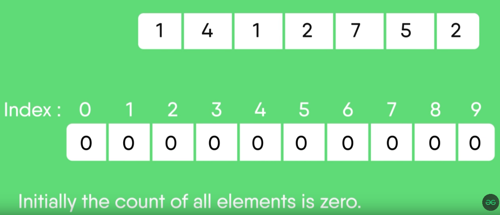
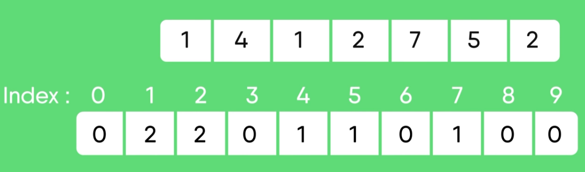
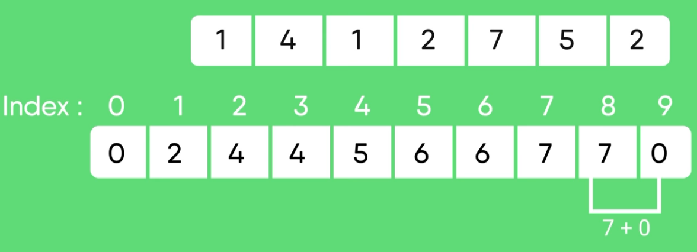
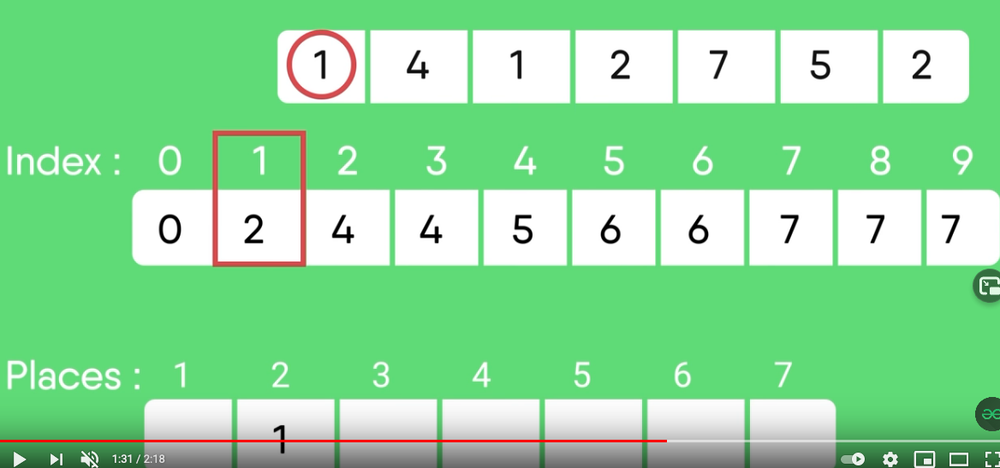

# Sorting Algorithms

[TOC]

## Count Sort

Counting sort is an algorithm for sorting a collection of objects according to keys that are small
integers; that is, it is an integer sorting algorithm. It operates by counting the number of objects that have each
distinct key value, and using arithmetic on those counts to determine the positions of each key value in the output
sequence. Its running time is linear in the number of items and the difference between the maximum and minimum key
values, so it is only suitable for direct use in situations where the variation in keys is not significantly greater
than the number of items. However, it is often used as a subroutine in another sorting algorithm, radix sort, that can
handle larger keys more efficiently.

### Example

Consider a list of `7` integers in the range `0 - 9`.

#### Step 1 - Count occurrences within range

Create a `counts` array of size `k+1` where k is the upper bound for the range. In this case the range is `0 - 9`, so the size of the `counts` array will be `10`; initialize it with zeros. This array will keep track of occurrences for each element in the range. Iterate over the original array and count all occurrences within the range.

#### Step 2 - Process 'counts' array

Iterate over the `counts` array and add the previous number to the current one (start at index `1`):

#### Step 3 - Form the sorted array

Use the processed `counts` array in addition to the original array to build the sorted array. This can be done by iterating over the original array, using the value as an index to fetch a value, which will become the index in the sorted array:

### Run Time Complexity

* Worst-Case performance: `O(n+k)` where `n` is the size of the array to sort and `k` is the range of the non-negative key values. 
* Worst-Case space: `O(n+k)`

